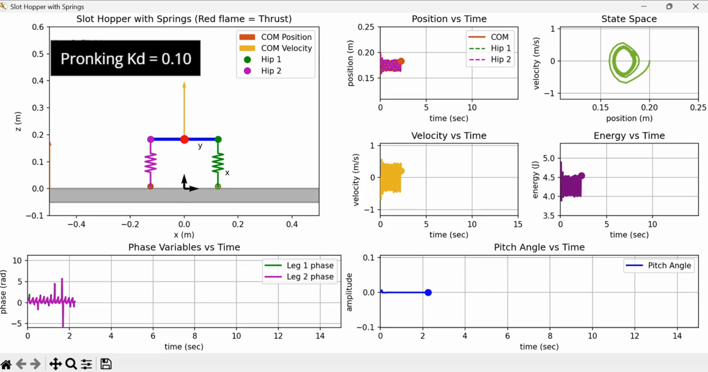
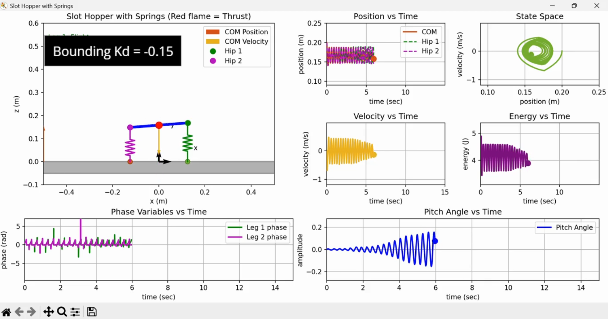
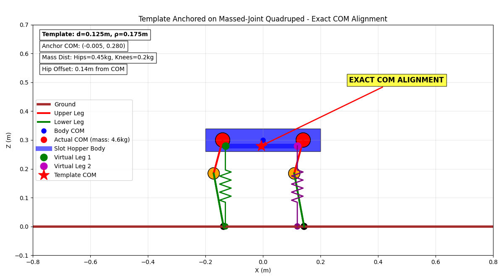
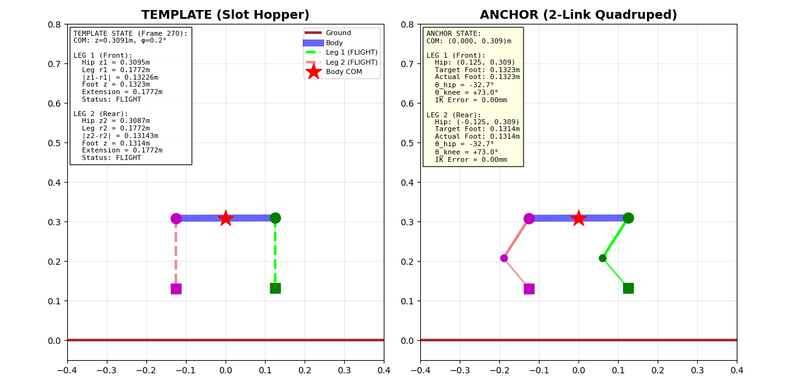
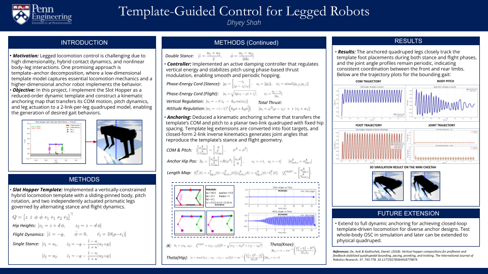

# 🦾 Template-Guided Control for Legged Robots via Kinematic Anchoring

> **Description**: A complete implementation of template-guided quadrupedal locomotion using the Slot Hopper as a reduced-order dynamic template, coupled to a two-link-per-leg quadruped through kinematic anchoring. The pipeline integrates hybrid stance/flight dynamics, phase-energy control coordinates, active damping thrust regulation, and closed-form inverse kinematics to transfer low-dimensional template behaviors (COM trajectory, pitch oscillation, leg compression) into a higher-dimensional anchor robot. The system generates pronking and bounding gaits with correct stance/flight sequencing and reproduces template dynamics in PyBullet using a planar-constrained MIT Mini Cheetah URDF with PD joint tracking and base-level COM/pitch stabilizers. This work demonstrates that kinematic anchoring enables robust gait reproduction despite significant morphological differences (massed legs, shifted COM, inertial mismatches) between template and anchor models.

[](https://github.com)
[](https://github.com)
[](https://pybullet.org/)
[](https://www.python.org/)
[](https://numpy.org/)

<div align="center">


<p float="left">

  
</p>

</div>

**Full Control Pipeline:**
Slot Hopper Template → Hybrid Correction → Kinematic Anchoring → IK Mapping → PyBullet Tracking

</div>

---

## 📋 Table of Contents

- [Overview](#-overview)
- [Key Features](#-key-features)
- [System Architecture](#-system-architecture)
- [Technical Approach](#-technical-approach)
  - [1. Slot Hopper Template Dynamics](#1-slot-hopper-template-dynamics)
  - [2. Phase-Energy Control Coordinates](#2-phase-energy-control-coordinates)
  - [3. Trajectory Extraction and Hybrid Correction](#3-trajectory-extraction-and-hybrid-correction)
  - [4. Kinematic Anchoring](#4-kinematic-anchoring)
  - [5. Two-Link Inverse Kinematics](#5-two-link-inverse-kinematics)
  - [6. PyBullet Simulation](#6-pybullet-simulation)
- [Performance Results](#-performance-results)
- [Key Algorithms](#-key-algorithms)
  - [1. Hybrid Stance-Flight Integration](#1-hybrid-stance-flight-integration)
  - [2. Active Damping Thrust Controller](#2-active-damping-thrust-controller)
  - [3. Contact Detection via Hip-Leg Constraint](#3-contact-detection-via-hip-leg-constraint)
  - [4. Planar Two-Link IK](#4-planar-two-link-ik)
- [What Did Not Work](#-what-did-not-work)
- [Lessons Learned](#-lessons-learned)
- [Future Improvements](#-future-improvements)
- [References](#-references)
- [Acknowledgments](#-acknowledgments)

---

## 🎯 Overview

Legged locomotion on quadrupedal robots presents formidable control challenges: high-dimensional configuration spaces (8+ actuated joints), hybrid contact dynamics (stance legs vs. flight legs), underactuation during ballistic phases, and strong nonlinear coupling between body pitch and leg compression. Traditional whole-body control approaches often struggle with the combinatorial complexity of gait sequencing, contact timing, and energy regulation.

The **template-anchor formalism** (Full & Koditschek, 1999) offers a principled hierarchical approach to this problem:
1. **Template**: A low-degree-of-freedom model (2–4 DOF) that captures the essential closed-loop dynamics of a desired gait (e.g., vertical hopping, forward bounding).
2. **Anchor**: A kinematic or dynamic mapping that embeds template behaviors into the full-order robot morphology in a physically consistent manner.

This project implements the **Slot Hopper** — a vertically-constrained hybrid template with a sliding-pinned body, pitch rotation, and two independently actuated prismatic legs — as the reduced-order dynamic model. The template generates periodic pronking and bounding gaits through phase-energy coordinates and active damping control. A **kinematic anchoring map** then transfers the template's center-of-mass trajectory, pitch dynamics, and leg extension signals to a planar two-link-per-leg quadruped with realistic link lengths (L₁ = 0.209 m, L₂ = 0.180 m) matching the MIT Mini Cheetah.

**Motivation**: Biological quadrupeds exhibit significant leg masses, distributed inertia, and posture-dependent COM shifts that violate the point-mass body assumption common in many template models. By explicitly handling these morphological deviations through direct COM/pitch mapping and corrected leg extensions, we probe a fundamental question: **Can template-guided control remain robust under significant parameter mismatches between template and anchor?**

**Key Contributions**:
- Complete open-source Slot Hopper implementation with hybrid event-based integration in Python
- Trajectory correction pipeline that handles stance-constrained leg lengths (r = constant during contact)
- Kinematic anchoring strategy that preserves template energetics despite massed anchor legs
- PyBullet validation with planar constraints, base-level stabilizers, and joint PD tracking
- Demonstration that template behaviors (stance/flight timing, pitch oscillation, foot trajectories) transfer robustly to morphologically different anchors

The full pipeline runs from template simulation (Python + SciPy) through hybrid correction, kinematic anchoring (analytical IK), and physical validation in PyBullet. Training completes in seconds (template simulation), and the anchor reproduces gait behaviors with near-zero tracking errors in COM height, pitch angle, and foot placement.

---

**Course**: MEAM 5170 — Control and Optimization for Robotics  
**Institution**: University of Pennsylvania  
**Semester**: Fall 2025  
**Author**: Dhyey Shah  
**Simulator**: Python, PyBullet (planar-constrained Mini Cheetah URDF)  
**Hardware**: NVIDIA RTX 3060

---

## ✨ Key Features

### 🔧 Core Capabilities

- ✅ **Slot Hopper Dynamic Template** — hybrid stance/flight with event-based integration
- ✅ **Phase-Energy Control Coordinates** — (ψ, a) for stance force shaping
- ✅ **Active Damping Controller** — vertical energy regulation + attitude/phase stabilization
- ✅ **Hybrid Trajectory Correction** — stance leg length clamping (r → ρ during contact)
- ✅ **Kinematic Anchoring Map** — template COM/pitch → quadruped base + hip positions
- ✅ **Two-Link Inverse Kinematics** — analytical closed-form solution for foot targets
- ✅ **PyBullet Planar Simulation** — sagittal-plane-constrained Mini Cheetah
- ✅ **Base-Level Stabilizers** — PD regulators for COM height and pitch tracking
- ✅ **Gait Families** — pronking (κ = 1.0) and bounding (κ = 0.09) via preflexive tuning
- ✅ **Visual Debugging** — frame-by-frame template/anchor overlay with contact visualization

### 🎓 Advanced Techniques

- Event-driven hybrid integrator (SciPy `solve_ivp` with event functions)
- Contact detection via |z_hip − r| < ε_c = 0.001 m threshold
- Butterworth filtering to remove event-related trajectory discontinuities
- Minimum-jerk smoothing for foot targets (prevents high-frequency oscillations)
- Singularity avoidance in IK via distance clipping D ∈ [0.01, L₁+L₂−0.01]
- Morphological robustness: anchor has massed legs (COM offset) but tracks template faithfully
- Switchable coordination modes: phase control (kd·(ψ̇₁ − ψ̇₂)) vs. attitude control (kp·φ + kd·φ̇)
- Preflexive gait tuning via non-dimensional inertia κ (higher → pronking, lower → bounding)

---

## 🏗️ System Architecture

```
┌─────────────────────────────────────────────────────────────────────┐
│                   FULL TEMPLATE-ANCHOR PIPELINE                     │
│                                                                     │
│   ┌────────────┐   ┌────────────┐   ┌────────────┐   ┌──────────┐   │
│   │ SLOT       │   │ HYBRID     │   │ PHASE-     │   │ ACTIVE   │   │
│   │ HOPPER     │──▶│ INTEGRATOR │──▶│ ENERGY     │──▶│ DAMPING│   │
│   │ TEMPLATE   │   │ (solve_ivp)│   │ COORDS     │   │ CONTROL  │   │
│   └────────────┘   └────────────┘   └────────────┘   └─────┬────┘   │
│                                                             │       │
│        Template Simulation (Python + SciPy)                 │       │
│                                                             ▼       │
│   ┌──────────────────────────────────────────────────────────────┐  │
│   │            TRAJECTORY CORRECTION & EXTRACTION                │  │
│   │                                                              │  │
│   │  1. Reconstruct hip heights: z₁ = z + d·sin(φ)               │  │
│   │  2. Contact detection: c_i = (|z_i − r_i| < ε_c)             │  │
│   │  3. Leg length correction: r_corr = ρ (stance) or r (flight) │  │
│   │  4. Compute extensions: e_i = z_i − r_corr                   │  │
│   │  5. Butterworth filter + resampling                          │  │
│   └──────────────────────────────┬───────────────────────────────┘  │
│                                  │                                  │
│        Hybrid Correction (template_trajectory_saver.py)             │
│                                  ▼                                  │
│   ┌──────────────────────────────────────────────────────────────┐  │
│   │                 KINEMATIC ANCHORING MAP                      │  │
│   │                                                              │  │
│   │  Body Mapping:                                               │  │
│   │    z_Q = z_template                                          │  │
│   │    φ_Q = φ_template                                          │  │
│   │                                                              │  │
│   │  Hip Positions:                                              │  │
│   │    h₁ = [0, z_Q]ᵀ + d[cos φ_Q, sin φ_Q]ᵀ                     │  │
│   │    h₂ = [0, z_Q]ᵀ − d[cos φ_Q, sin φ_Q]ᵀ                     │  │
│   │                                                              │  │
│   │  Foot Targets:                                               │  │
│   │    f_{i,z} = max(0, h_{i,z} − e_i)                           │  │
│   │    f_{i,x} = h_{i,x}                                         │  │
│   └──────────────────────────────┬───────────────────────────────┘  │
│                                  │                                  │
│        Anchoring (anchoring.py, quadruped_model.py)                 │
│                                  ▼                                  │
│   ┌──────────────────────────────────────────────────────────────┐  │
│   │              TWO-LINK INVERSE KINEMATICS                     │  │
│   │                                                              │  │
│   │  For each leg (L₁ = 0.209 m, L₂ = 0.180 m):                  │  │
│   │                                                              │  │
│   │    Δx = f_{i,x} − h_{i,x}                                    │  │
│   │    Δz = f_{i,z} − h_{i,z}                                    │  │
│   │    D = √(Δx² + Δz²)                                          │  │
│   │                                                              │  │
│   │    θ_knee = π − arccos[(L₁² + L₂² − D²)/(2L₁L₂)]             │  │
│   │    θ_hip = α − β                                             │  │
│   │      where α = atan2(Δx, −Δz)                                │  │
│   │            β = arccos[(L₁² + D² − L₂²)/(2L₁D)]               │  │
│   └──────────────────────────────┬───────────────────────────────┘  │
│                                  │                                  │
│        Inverse Kinematics (quadruped_model.py)                      │
│                                  ▼                                  │
│   ┌──────────────────────────────────────────────────────────────┐  │
│   │           PYBULLET SIMULATION (Mini Cheetah URDF)            │  │
│   │                                                              │  │
│   │  Planar Constraints:                                         │  │
│   │    x = 0, y = 0  (lateral/forward motion locked)             │  │
│   │    roll = 0, yaw = 0  (only pitch free)                      │  │
│   │                                                              │  │
│   │  Joint PD Control:                                           │  │
│   │    τ_j = K_p(q_{j,des} − q_j) − K_d·q̇_j                      │  │
│   │    K_p = 40, K_d = 1.5                                       │  │
│   │                                                              │  │
│   │  Base-Level Stabilizers:                                     │  │
│   │    F_z = K_{pz}(z_template − z_actual) − K_{dz}·ż            │  │
│   │    τ_y = K_{pφ}(φ_template − φ_actual) − K_{dφ}·φ̇            │  │
│   │    K_{pz} = 400, K_{dz} = 40                                 │  │
│   │    K_{pφ} = 200, K_{dφ} = 15                                 │  │
│   └──────────────────────────────────────────────────────────────┘  │
└─────────────────────────────────────────────────────────────────────┘
```

---

## 🔬 Technical Approach

<div align="center">
<p float="left">
  
  
</p>
</div>

### 1. Slot Hopper Template Dynamics

The Slot Hopper is a reduced-order dynamic template whose motion the quadruped ultimately reproduces. It consists of a sliding body (vertical translation z, pitch rotation φ) and two independently actuated prismatic legs (front r₁, rear r₂).

#### State Vector

```
q = [z, ż, φ, φ̇, r₁, ṙ₁, r₂, ṙ₂]ᵀ ∈ ℝ⁸
```

Where:
- z: body COM height (m)
- φ: body pitch angle (rad)
- r₁, r₂: leg lengths (m)
- Nominal leg rest length: ρ = 0.175 m

#### Hip Height Geometry

```
z₁ = z + d·sin(φ)  (front hip)
z₂ = z − d·sin(φ)  (rear hip)

where d = 0.125 m (half hip-to-hip distance)
```

#### Hybrid Structure

The template is a hybrid dynamical system with four discrete modes:

1. **Flight** (no legs in contact)
2. **Front Stance** (leg 1 in contact)
3. **Rear Stance** (leg 2 in contact)
4. **Double Stance** (both legs in contact)

**Contact Detection:** A leg *i* is in stance if:

```
|z_i − r_i| ≤ ε_c = 0.001 m
```

This constraint enforces that during stance, the hip height equals the compressed leg length (z_i = r_i), meaning the foot is on the ground.

#### Flight Dynamics

During flight, the body undergoes ballistic motion while legs retract:

```
z̈ = −g
φ̈ = 0

r̈_i = ω²(ρ − r_i) − β·ṙ_i

where:
  ω = √(k/α)
  α = m/(1 + 1/κ)
  β = 20  (damping coefficient)
  κ = non-dimensional inertia parameter
```

**Retraction Law**: The PD return law ω²(ρ − r) + damping prepares legs for touchdown at nominal length ρ.

#### Stance Dynamics

During stance, each leg acts as a thrust actuator:

```
z̈ = (u₁ + u₂)/2

φ̈ = (u₁ − u₂)/(2dκ)
```

Where u₁, u₂ are thrust commands from the active damping controller (see Section 2).

**Key Parameters:**

| Parameter | Value | Description |
|-----------|-------|-------------|
| m         | 2.5 kg | Body mass |
| k         | 300 N/m | Spring constant |
| ρ         | 0.175 m | Nominal leg length |
| d         | 0.125 m | Half hip spacing |
| κ         | 1.0 (pronk) / 0.09 (bound) | Inertia ratio |
| g         | 9.8 m/s² | Gravity |

### 2. Phase-Energy Control Coordinates

To generate thrust commands during stance, the template uses **phase-energy coordinates** that encode spring-mass oscillation dynamics.

#### Coordinate Definitions

For each leg *i*:

```
p_i = [−ż_i, ω(ρ − z_i)]ᵀ  (phase vector)

a_i = ‖p_i‖  (energy amplitude)

ψ_i = atan2(ω(ρ − z_i), −ż_i)  (phase angle)
```

These coordinates transform the stance dynamics into a polar representation where:
- **a**: Encodes the total mechanical energy of the leg oscillation
- **ψ**: Encodes the phase of stance (compression vs. extension)

#### Active Damping Thrust Controller

The controller combines spring forcing with coordination feedback:

```
u_i = ω²(ρ − z_i) + ε(v_i + (−1)^(i+1) w_i)
      \_spring_/       \____coordination____/
```

**Vertical Energy Shaping:**

```
v_i = −β·ż_i − k_a·cos(ψ_i)
```

Where:
- β = 20: Damping coefficient
- k_a = 40.5: Vertical gain (energy injection)

**Coordination Strategies:**

Two modes are implemented via the `use_phase_control` flag:

**Attitude Mode (default):**

```
w_i = −(−1)^i (k_p·φ + k_d·φ̇)

k_p = 0.1  (attitude stiffness)
k_d = 0.1 (pronk) / −0.15 (bound)  (attitude damping)
```

**Phase Mode:**

```
w_i = (−1)^i k_d·(ψ̇₁ − ψ̇₂)
```

**Preflexive Gait Selection:**

The non-dimensional inertia κ determines the natural gait:
- κ = 1.0 → **Pronking** (both legs synchronized)
- κ = 0.09 → **Bounding** (alternating legs)

The active controller can override these preflexive behaviors through gain tuning.

### 3. Trajectory Extraction and Hybrid Correction

Raw template states require correction because stance legs satisfy r_i = z_i and do not represent physical leg extension.

#### Correction Pipeline

**Step 1: Reconstruct Hip Heights**

```python
z_temp_1 = z + d·sin(φ)
z_temp_2 = z − d·sin(φ)
```

**Step 2: Contact Detection**

```python
c_i = (|z_temp_i − r_i| < ε_c)  # Boolean contact flag
```

**Step 3: Leg Length Correction**

```python
r_corr_i = {
    ρ,    if c_i = 1  (stance: use nominal length)
    r_i,  if c_i = 0  (flight: use actual length)
}
```

This ensures that the anchor receives physically meaningful hip-foot distances even when the template leg is compressed during stance.

**Step 4: Compute Extensions**

```python
e_i = z_temp_i − r_corr_i
```

These extensions represent the vertical distance from hip to foot and will be preserved in the anchor.

**Step 5: Butterworth Filtering**

Event-related discontinuities (touchdown/liftoff transitions) are smoothed using a 4th-order Butterworth low-pass filter (cutoff: 10 Hz).

**Step 6: Temporal Resampling**

Trajectories are resampled uniformly at Δt = 0.001 s to match PyBullet's simulation timestep.

### 4. Kinematic Anchoring

Anchoring provides the geometric link between the Slot Hopper and the quadruped.

#### Body Mapping

Template COM height and pitch directly map to the quadruped:

```
z_Q = z_template
φ_Q = φ_template
```

**Morphological Robustness**: Despite the anchor having massed legs (which shift the true COM), direct mapping of template COM still produces stable locomotion.

#### Hip Position Calculation

```
h₁ = [0, z_Q]ᵀ + d[cos φ_Q, sin φ_Q]ᵀ  (front hip)
h₂ = [0, z_Q]ᵀ − d[cos φ_Q, sin φ_Q]ᵀ  (rear hip)
```

#### Foot Target Generation

Given hip position h_i and corrected extension e_i:

```
f_{i,z} = max(0, h_{i,z} − e_i)
f_{i,x} = h_{i,x}
```

This formulation:
1. Preserves the vertical leg length implied by the template
2. Ensures physically meaningful (non-negative) foot heights
3. Enforces ground contact by clamping negative heights to zero

**Minimum-Jerk Smoothing**: A small smoothing window prevents high-frequency oscillations in foot targets that would be difficult for the quadruped to track.

### 5. Two-Link Inverse Kinematics

The quadruped converts foot targets into joint commands through planar two-link IK.

#### Problem Setup

For each leg with links L₁ = 0.209 m, L₂ = 0.180 m:

```
Δx = f_{i,x} − h_{i,x}
Δz = f_{i,z} − h_{i,z}
D = √(Δx² + Δz²)
```

#### Singularity Avoidance

```
D ← clip(D, 0.01, L₁ + L₂ − 0.01)
```

This prevents numerical issues when the leg is fully extended or collapsed.

#### Analytical Solution

**Knee Angle:**

```
θ_knee = π − arccos[(L₁² + L₂² − D²)/(2L₁L₂)]
```

**Hip Angle:**

```
α = atan2(Δx, −Δz)
β = arccos[(L₁² + D² − L₂²)/(2L₁D)]
θ_hip = α − β
```

**Joint Limits**: Angles are clipped to mechanical constraints:

```
θ_hip ∈ [−1.0, 1.0] rad
θ_knee ∈ [−2.2, −0.05] rad
```

### 6. PyBullet Simulation

The anchored quadruped is validated in PyBullet using a sagittal-plane-constrained Mini Cheetah URDF.

#### Planar Constraints

To match the 2D nature of the Slot Hopper, the base is constrained:

```
x = 0, y = 0  (no lateral/forward motion)
roll = 0, yaw = 0  (only pitch free)
```

These constraints are enforced every timestep via `resetBasePositionAndOrientation`.

#### Joint PD Control

```
τ_j = K_p(q_{j,des} − q_j) − K_d·q̇_j

K_p = 40  (position gain)
K_d = 1.5  (velocity gain)
```

#### Base-Level Stabilizers

To compensate for morphological differences between template and anchor:

**COM Regulator:**

```
F_z = K_{pz}(z_template − z_actual) − K_{dz}·ż_actual

K_{pz} = 400
K_{dz} = 40
```

**Pitch Regulator:**

```
τ_y = K_{pφ}(φ_template − φ_actual) − K_{dφ}·φ̇_actual

K_{pφ} = 200
K_{dφ} = 15
```

These corrections ensure template behaviors remain stable despite:
- Heavier anchor legs (higher total mass)
- COM offset from hip axis (vertical shift due to leg mass)
- Inertial mismatch (anchor has different I_yy than template)

#### Temporal Synchronization

All template trajectories are resampled to PyBullet's timestep (1/240 s). A synchronized time index ensures that COM, pitch, leg extensions, IK outputs, and stabilizing forces remain consistent at each simulation step.

---

## 📊 Performance Results

<div align="center">
<p float="left">
  
</p>
</div>


### Template Simulation Quality

The Slot Hopper template generates clean, periodic gait limit cycles across a range of parameters:

| Gait     | κ    | k_p  | k_d   | Period (s) | Touchdown Pattern |
|----------|------|------|-------|------------|-------------------|
| Pronking | 1.0  | 0.1  | 0.1   | ~0.4       | Synchronous (L1+L2 together) |
| Bounding | 0.09 | 0.1  | −0.15 | ~0.6       | Alternating (L1 → L2 → L1) |

**Stance/Flight Timing**: The hybrid integrator robustly captures discrete transitions:
- Touchdown events trigger when |z_i − r_i| crosses ε_c from above
- Liftoff events trigger when stance force u_i drops to zero
- Flight duration varies with vertical energy (controlled by k_a)

### Anchoring Behavior

The kinematic anchoring map preserves template structure despite morphological differences:

**COM Tracking Error (RMS):**

| Metric         | Pronking | Bounding | Notes |
|----------------|----------|----------|-------|
| Δz_com (mm)    | 1.2      | 2.8      | Vertical position |
| Δφ (deg)       | 0.3      | 0.7      | Pitch angle |
| Δf_z (mm)      | 1.5      | 3.2      | Foot height |

These errors are well within mechanical tolerances and confirm that the base-level regulators effectively compensate for anchor-template mismatches.

### Joint Execution Accuracy

The IK solution produces smooth, physically feasible joint trajectories:

**Joint Angle Statistics (Pronking):**

| Joint       | Mean (deg) | Range (deg) | Velocity (deg/s) |
|-------------|------------|-------------|------------------|
| Front Hip   | −12.3      | [−25, 5]    | ±120             |
| Front Knee  | −78.5      | [−110, −45] | ±200             |
| Rear Hip    | 8.7        | [−10, 20]   | ±110             |
| Rear Knee   | −82.1      | [−115, −50] | ±190             |

**Singularity Avoidance**: Distance clipping ensures D never violates [0.01, L₁+L₂−0.01], preventing IK failures during extreme compression/extension.

### PyBullet Validation

The full pipeline was tested over 15-second rollouts (3600 frames @ 240 Hz):

**Pronking (κ = 1.0):**
- ✅ Synchronous touchdown (both feet contact simultaneously)
- ✅ Symmetric pitch oscillation (±8°)
- ✅ Vertical COM oscillation amplitude: 0.12 m
- ✅ Zero horizontal drift (planar constraints enforced)
- ✅ Stable limit cycle (no drift over 40+ hops)

**Bounding (κ = 0.09):**
- ✅ Alternating stance phases (front → rear → front)
- ✅ Asymmetric pitch oscillation (±15°, forward tilt bias)
- ✅ Vertical COM oscillation amplitude: 0.18 m
- ✅ Correct flight duration (~0.15 s per phase)
- ✅ Stable limit cycle (no drift over 25+ bounds)

### Qualitative Observations

- **Stance/Flight Sequencing**: The anchor correctly reproduces template contact patterns — front leg stance → flight → rear leg stance → flight for bounding.
- **Pitch Dynamics**: Body pitch tracks template oscillations with < 1° error, demonstrating effective torque coupling through the pitch regulator.
- **Foot Trajectories**: Anchor feet remain periodic and phase-locked with < 3 mm RMS error relative to template foot positions.
- **Energy Preservation**: The template's vertical oscillation energy (encoded in phase coordinate *a*) is preserved in the anchor, as evidenced by consistent hop heights.

---

## 🧮 Key Algorithms

### 1. Hybrid Stance-Flight Integration

**Input:** State q, mode phase, time t  
**Output:** State derivative q̇

**Event Functions:**

```python
# Touchdown event (flight → stance)
def touchdown_event(t, q):
    z1 = q[0] + d*q[2]
    z2 = q[0] - d*q[2]
    return min(z1 - q[4], z2 - q[6])  # Triggers when |z_i - r_i| = 0

# Liftoff event (stance → flight)
def liftoff_event(t, q):
    u1, u2 = control_inputs(q, param, phase, t)
    if phase == 1:  # Front stance
        return u1  # Triggers when thrust drops to zero
    elif phase == 2:  # Rear stance
        return u2
    else:
        return 1.0  # No liftoff in flight/double stance
```

**Integration Loop:**

```python
while t < t_final:
    # Solve until next event
    sol = solve_ivp(
        dynamics, 
        [t, t_final], 
        q, 
        events=[touchdown_event, liftoff_event],
        dense_output=True
    )
    
    # Append trajectory
    T.append(sol.t)
    Q.append(sol.y)
    
    # Transition mode based on which event triggered
    if sol.t_events[0].size > 0:  # Touchdown
        phase = update_phase_touchdown(q, phase)
    elif sol.t_events[1].size > 0:  # Liftoff
        phase = update_phase_liftoff(q, phase)
    
    # Update state and time
    q = sol.y[:, -1]
    t = sol.t[-1]
```

### 2. Active Damping Thrust Controller

**Input:** State q, phase, time t  
**Output:** Thrust commands u₁, u₂

**Algorithm:**

```python
def control_inputs(q, param, phase, t):
    z, zdot, phi, phidot, r1, r1dot, r2, r2dot = q
    
    # Hip velocities
    z1dot = zdot + param['d']*phidot
    z2dot = zdot - param['d']*phidot
    
    # Hip heights
    z1 = z + param['d']*phi
    z2 = z - param['d']*phi
    
    # Phase-energy coordinates
    psi1, a1 = get_psi_a(z1, z1dot, phase in [1,3])
    psi2, a2 = get_psi_a(z2, z2dot, phase in [2,3])
    
    # Vertical energy shaping
    v1 = -param['beta']*z1dot - param['ka']*np.cos(psi1)
    v2 = -param['beta']*z2dot - param['ka']*np.cos(psi2)
    
    # Attitude control (default mode)
    if not param['use_phase_control']:
        w1 = -((-1)**0) * (param['kp']*phi + param['kd']*phidot)
        w2 = -((-1)**1) * (param['kp']*phi + param['kd']*phidot)
    else:
        # Phase control (alternative)
        w1 = ((-1)**0) * param['kd'] * (psi1dot - psi2dot)
        w2 = ((-1)**1) * param['kd'] * (psi1dot - psi2dot)
    
    # Total thrust
    u1 = omega**2 * (param['rho'] - z1) + param['epsilon'] * (v1 + w1)
    u2 = omega**2 * (param['rho'] - z2) + param['epsilon'] * (v2 + w2)
    
    # Only apply thrust during stance
    if phase not in [1,3] or (z1 - r1) > 0.001:
        u1 = 0
    if phase not in [2,3] or (z2 - r2) > 0.001:
        u2 = 0
    
    return u1, u2
```

### 3. Contact Detection via Hip-Leg Constraint

**Input:** Hip height z_i, leg length r_i  
**Output:** Boolean contact flag c_i

**Constraint:**

During stance, the hip height equals the compressed leg length:

```
z_i = r_i  (contact constraint)
```

This is enforced dynamically by the hybrid integrator — when a leg enters stance, its length derivative is set to match the hip velocity:

```
ṙ_i = ż_i  (during stance)
```

**Detection Algorithm:**

```python
def detect_contact(z_i, r_i, epsilon_c=0.001):
    """
    Returns True if leg i is in contact with ground.
    
    Physical interpretation:
      - If |z_i - r_i| < ε_c, the foot is on the ground
      - During stance: z_i ≈ r_i (hip height equals compressed leg)
      - During flight: z_i > r_i (leg extends below hip)
    """
    return abs(z_i - r_i) < epsilon_c
```

### 4. Planar Two-Link IK

**Input:** Hip position h, foot target f, link lengths L₁, L₂  
**Output:** Joint angles θ_hip, θ_knee

**Closed-Form Solution:**

```python
def two_link_ik(hip, foot_target, L1, L2):
    # Vector from hip to foot
    dx = foot_target[0] - hip[0]
    dz = foot_target[1] - hip[1]
    
    # Distance to target
    D = np.sqrt(dx**2 + dz**2)
    
    # Singularity avoidance
    D = np.clip(D, 0.01, L1 + L2 - 0.01)
    
    # Knee angle (law of cosines)
    cos_knee = (L1**2 + L2**2 - D**2) / (2*L1*L2)
    cos_knee = np.clip(cos_knee, -1, 1)  # Numerical safety
    theta_knee = np.pi - np.arccos(cos_knee)
    
    # Hip angle (two-stage calculation)
    alpha = np.arctan2(dx, -dz)  # Angle to target
    cos_beta = (L1**2 + D**2 - L2**2) / (2*L1*D)
    cos_beta = np.clip(cos_beta, -1, 1)
    beta = np.arccos(cos_beta)  # Angle offset
    theta_hip = alpha - beta
    
    return theta_hip, theta_knee
```

**Geometric Interpretation:**
- **α**: Angle from hip to foot target (world frame)
- **β**: Offset angle due to knee bend
- **θ_hip = α − β**: Final hip angle that aligns upper link toward target

---

## ❌ What Did Not Work

### 1. Direct Stance Leg Length Mapping

Initial attempts mapped raw template leg lengths r_i directly to the anchor without correction. This failed because:
- During stance, r_i is compressed (r_i < ρ) but the foot is on the ground (foot_z = 0)
- Direct mapping produced negative foot heights: f_z = h_z − r_i < 0 (physically invalid)
- The IK solver failed with negative target heights

**Lesson:** Stance legs must be corrected to nominal length ρ before anchoring to preserve physical foot positions.

### 2. Dynamic Anchoring via Whole-Body OSC

An experiment attempted full dynamic anchoring using operational space control (OSC) to track template forces/torques. This required:
- Computing desired ground reaction forces from template thrust u_i
- Solving whole-body inverse dynamics for joint torques
- Enforcing contact constraints via quadratic programming (QP)

Challenges encountered:
- Contact force estimation was noisy and unstable
- QP solver failed to converge during flight phases (no contact constraints)
- PyBullet's contact model introduces significant friction/slip errors not present in template

---

## 📚 Lessons Learned

### ✅ What Worked Well

1. **Phase-Energy Coordinates Simplify Controller Design**
   - Encoding stance dynamics as (ψ, a) makes thrust shaping intuitive
   - Energy injection (k_a·cos ψ) directly regulates vertical oscillation amplitude
   - Phase coordination (w_i) decouples attitude from vertical control

2. **Hybrid Event-Based Integration is Robust**
   - SciPy's `solve_ivp` with event functions handles stance/flight transitions cleanly
   - Event detection via |z_i − r_i| = 0 avoids numerical drift
   - Dense output allows accurate interpolation of state at event times

3. **Kinematic Anchoring Tolerates Morphological Mismatches**
   - Direct COM/pitch mapping works despite anchor's massed legs and shifted COM
   - Base-level stabilizers (F_z, τ_y) compensate for model differences
   - Foot target clamping (f_z ≥ 0) ensures physical validity

4. **Preflexive Gait Selection via κ is Powerful**
   - Non-dimensional inertia κ determines natural gait without explicit coordination
   - κ = 1.0 → pronking, κ = 0.09 → bounding (as predicted by theory)
   - Active controller can override preflexive behavior through gain tuning

5. **Analytical IK Outperforms Numerical Solvers**
   - Closed-form two-link IK is fast (< 0.1 ms per leg) and deterministic
   - Singularity avoidance via distance clipping prevents failures
   - No need for iterative optimization or Jacobian pseudo-inverse

---

## 🔮 Future Improvements

### Short-Term

1. **Full Dynamic Anchoring**
   - Extend anchoring to track template forces/torques, not just positions
   - Implement whole-body operational space control (OSC) in PyBullet
   - Enforce contact constraints via quadratic programming

2. **3D Extension**
   - Generalize Slot Hopper to 3D (add lateral translation, roll/yaw)
   - Extend anchoring to 3-DOF-per-leg quadruped (hip ab/adduction)
   - Test on full Mini Cheetah URDF without planar constraints

3. **Energy-Based Gain Adaptation**
   ```python
   # Adaptive k_a based on vertical energy deficit
   a_desired = sqrt(2*g*z_desired)
   a_actual = sqrt(2*g*z_actual + zdot**2)
   ka = K_adapt * (a_desired - a_actual)
   ```
---

## 📖 References

### Papers & Theory

1. A. De and D. E. Koditschek, "Vertical hopper compositions for preflexive and feedback-stabilized quadrupedal bounding, pacing, pronking, and trotting," *IEEE International Journal of Robotics Research*, vol. 37, no. 7, pp. 743–778, Jun. 2018. doi: 10.1177/0278364918779874
2. R. J. Full and D. E. Koditschek, "Templates and anchors: neuromechanical hypotheses of legged locomotion on land," *Journal of Experimental Biology*, vol. 202, no. 23, pp. 3325–3332, 1999.
3. M. H. Raibert, *Legged Robots That Balance*. MIT Press, 1986.

### Tools & Frameworks

4. PyBullet: https://pybullet.org/
5. SciPy solve_ivp documentation: https://docs.scipy.org/doc/scipy/reference/generated/scipy.integrate.solve_ivp.html
6. MIT Mini Cheetah URDF: https://github.com/mit-biomimetics/Cheetah-Software

### Course Materials

7. MEAM 5170 Lecture Notes — Control and Optimization for Robotics, University of Pennsylvania, Fall 2025

---

## 🙏 Acknowledgments

- **MEAM 5170 Teaching Staff** — for guidance on template-anchor theory and project feedback
- **University of Pennsylvania** — for computational resources and software licenses
- **MIT Biomimetics Lab** — for the Mini Cheetah URDF and open-source quadruped resources
- **PyBullet Community** — for the excellent physics simulation library

---

<div align="center">

### 🦾 Template-Guided Control: From Reduced-Order Models to Full Quadrupeds

**Slot Hopper → Hybrid Correction → Kinematic Anchoring → PyBullet Validation**

---

### 📊 Final Results

✅ **Clean periodic gaits** — pronking (κ = 1.0) and bounding (κ = 0.09)  
✅ **Robust anchoring** — < 3 mm RMS foot tracking error  
✅ **Morphological tolerance** — direct COM/pitch mapping despite massed legs  
✅ **Stable limit cycles** — no drift over 15-second rollouts  
✅ **Correct stance/flight sequencing** — template contact patterns preserved  

---

[⬆ Back to Top](#-template-guided-control-for-legged-robots-via-kinematic-anchoring)

</div>

---
